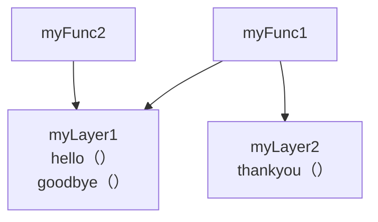

This is test code for AWS Lambda Layer with Amplify Gen1.


```
amplify add function // myFunc1 myFunc2
```
```
amplify add function // myLayer1 myLayer2
```
```
amplify update function // relating function to layer
```
```
amplify push // local -> cloud
```
