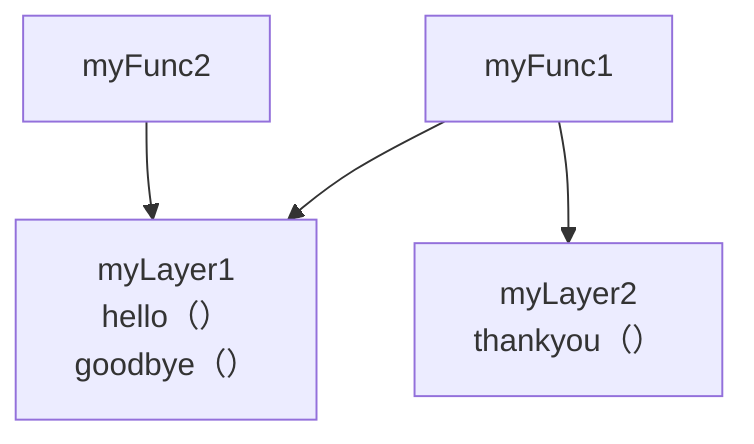

This is test code for AWS Lambda Layer with Amplify.

```mermaid
flowchart TD
    AA[myFunc1]
    AB[myFunc2]
    BA[myLayer1<br>hello（）<br>goodbye（）]
    BB[myLayer2<br>thankyou（）]
    AA --> BA
    AA --> BB
    AB --> BA
```
