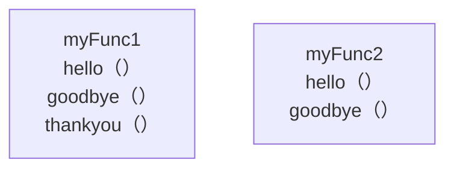
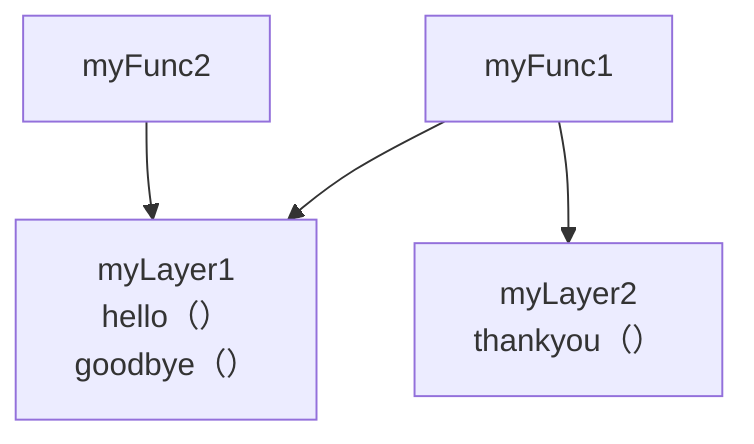

# Overview
This is test code for AWS Lambda Layer with Amplify Gen1.<br>
I could do successfully.
## Without using Layer

if you update hello(), you need to update both func1 and func2.

## Using Layer

By introducing a Layer, you only need to update the code in one place.

# Step
```
amplify add function // myFunc1 myFunc2
```
```
amplify add function // myLayer1 myLayer2
```
```
amplify update function // relating function to layer
```
```
amplify push // local -> cloud
```
You will confirm related in Lambda Console.
